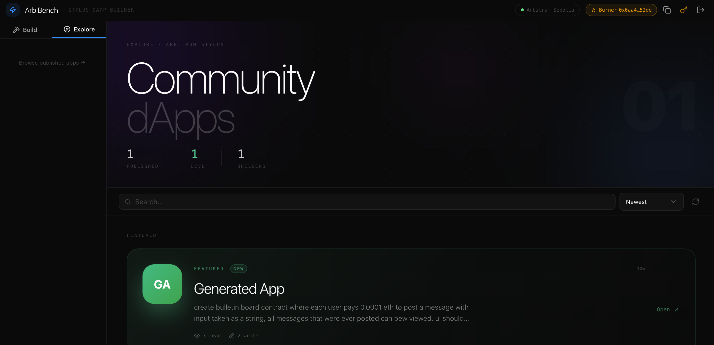

# ArbiBench

**[Demo Video](https://drive.google.com/file/d/1PNsED_vicVyCW_ZfAjz2Ozm2xV-QLoeo/view?usp=sharing)**



AI-powered dApp builder for Arbitrum Stylus. Describe a smart contract in plain English — ArbiBench generates the Rust source, compiles it with `cargo-stylus`, auto-fixes build errors, deploys to Arbitrum Sepolia, and renders a live interactive UI. No Rust knowledge required.

Built for the [ArbiLink Hackathon](https://arbilink.io) — April 2026.

---

## How it works

1. **Describe** — Type what you want ("create an NFT that mints for 0.0001 ETH, max 9 total")
2. **Generate** — Gemini 2.0 Flash writes the Rust contract, Cargo.toml, UI schema, and ABI
3. **Build loop** — `cargo stylus check` runs; on failure, compiler errors go back to the LLM for up to 3 fix rounds
4. **UI-only changes** — if you modify the interface without touching contract logic, the build is skipped entirely
5. **Deploy** — one click sends the contract to Arbitrum Sepolia via `cargo stylus deploy`
6. **Interact** — the Preview tab renders the UI schema as live React components connected to the deployed contract

---

## Features

- **AI contract generation** — Rust + ABI + React UI schema from a single prompt
- **Build-fix loop** — compiler errors are fed back to the LLM automatically (up to 3 rounds per attempt)
- **UI-only modification detection** — unchanged contract code skips the full build pipeline
- **Real-time log streaming** — compile and deploy output via SSE, visible in the chat panel
- **Live contract interaction** — call view and write functions directly from the Preview tab after deploy
- **Dual wallet** — MetaMask (wagmi/injected) or a local burner wallet (no extension, viem `privateKeyToAccount`)
- **Sign In With Ethereum** — SIWE nonce-based auth; only the owner wallet can edit or deploy an app
- **Monaco code editor** — edit lib.rs, Cargo.toml, or UI schema JSON manually
- **Compile button** — `cargo stylus check` on demand without deploying
- **Version history** — every successful build creates a snapshot; label, browse, and restore any version
- **Project settings** — name, description, tags, logo URL, website URL stored per project
- **Persistent chat** — per-app conversation history in localStorage

---

## Agent Registration

The ArbiBench AI agent is registered on the ArbiLink Agent Registry on Arbitrum Sepolia:

**TX:** `0x576537efa3392a680e91d9716286531ebb88baaebc2290dede74a314fdfa9e88`

[View on Arbiscan](https://sepolia.arbiscan.io/tx/0x576537efa3392a680e91d9716286531ebb88baaebc2290dede74a314fdfa9e88)

---

## Tech stack

| Layer | Technology |
|-------|-----------|
| Frontend | React 19, Vite 8, TypeScript, Tailwind CSS 4, shadcn/ui |
| Backend | Node.js, Express 5, TypeScript, tsx (watch mode) |
| Database | SQLite — better-sqlite3, WAL mode |
| LLM | Google Gemini 2.0 Flash via OpenRouter |
| Wallet | wagmi 3 + viem 2 (MetaMask) / viem accounts (burner) |
| Auth | Sign In With Ethereum (SIWE), verified server-side with viem |
| Contracts | Arbitrum Stylus SDK 0.10.2 (Rust → WASM) |
| Toolchain | Rust 1.87.0, cargo-stylus, wasm32-unknown-unknown |
| Network | Arbitrum Sepolia testnet |

---

## Project structure

```
arbibench/
├── client/               # Vite + React frontend (port 5173)
│   └── src/
│       ├── components/   # ChatPanel, CodePanel, DynamicRenderer, Header, Sidebar,
│       │                 # ProjectSettings, VersionHistory, ContractEditor, …
│       ├── contexts/     # WalletContext — routes txs to burner or wagmi
│       ├── hooks/        # useAuth, useApps, useChat
│       ├── lib/          # burnerWallet, parseAbi, utils
│       └── types/        # schema.ts (extends shared + ChatItem display types)
├── server/               # Express API (port 3001)
│   └── src/
│       ├── prompts/      # system.ts — Stylus SDK 0.10.2 knowledge base for LLM
│       ├── routes/       # auth, apps (+ versions), chat, deploy, compile
│       └── services/     # agent, llm, deploy (build pipeline), storage, wallet
├── shared/               # Shared TypeScript interfaces (App, UISchema, AgentEvent, …)
└── package.json          # npm workspaces monorepo
```

---

## Prerequisites

- Node.js 20+
- Rust 1.87.0 — `rustup toolchain install 1.87.0`
- `cargo install cargo-stylus`
- An [OpenRouter](https://openrouter.ai) API key
- A funded Arbitrum Sepolia wallet for the agent deployer

---

## Setup

```bash
git clone <repo>
cd arbibench
npm install
```

Create `.env` in the repo root:

```env
OPENROUTER_API_KEY=sk-or-v1-...
AGENT_PRIVATE_KEY=0x...          # deployer wallet private key
ARBITRUM_SEPOLIA_RPC=https://sepolia-rollup.arbitrum.io/rpc
AGENT_REGISTRATION_TX=0x576537efa3392a680e91d9716286531ebb88baaebc2290dede74a314fdfa9e88
```

The agent wallet needs Arbitrum Sepolia ETH to pay gas. Get some from the [Arbitrum faucet](https://faucet.arbitrum.io).

---

## Running locally

```bash
# Terminal 1 — backend
npm run dev:server

# Terminal 2 — frontend
npm run dev:client
```

Or start both at once:

```bash
npm run dev
```

Open [http://localhost:5173](http://localhost:5173).

---

## API reference

| Method | Route | Description |
|--------|-------|-------------|
| GET | `/api/health` | Server status + agent wallet address |
| GET | `/api/auth/nonce/:address` | Get SIWE nonce |
| POST | `/api/auth/verify` | Verify signature, return authenticated address |
| GET | `/api/apps` | List apps (`?owner=0x…` to filter) |
| GET | `/api/apps/:id` | Get single app |
| POST | `/api/apps` | Create app |
| PUT | `/api/apps/:id` | Update app code/metadata (owner only) |
| DELETE | `/api/apps/:id` | Delete app (owner only) |
| POST | `/api/chat` | Agent session — generate/modify/build (SSE) |
| POST | `/api/compile` | Compile-check only, no deploy (SSE) |
| POST | `/api/apps/:id/deploy` | Deploy to Arbitrum Sepolia (SSE) |
| GET | `/api/apps/:id/versions` | Version history |
| PATCH | `/api/apps/:id/versions/:vId/label` | Rename a version |
| POST | `/api/apps/:id/versions/:vId/restore` | Restore a previous version |

Write endpoints require `x-wallet-address: 0x…` header matching the app owner.

---

## Agent pipeline

```
User message
     │
     ▼
LLM (Gemini 2.0 Flash) ──parse error──► retry up to 3×
     │  contractCode + cargoToml + uiSchema + abi
     ▼
Contract unchanged from previous?
  ├─ Yes ──► skip build, update UI schema only
  └─ No
        ▼
   cargo stylus check
        ├─ pass ──► save app + create version snapshot
        └─ fail ──► send compiler errors to LLM for fix
                         └─ retry up to 3× then mark failed
```

The system prompt (`server/src/prompts/system.ts`) is injected into every LLM call — initial generation, modification, and error fixing. It contains: Stylus SDK 0.10.2 syntax rules, complete working contract examples (NFT, ERC-20-like token, tip jar), U256 arithmetic patterns, common compiler error → fix mappings, and storage type constraints.

---

## Burner wallet

Click **Burner Wallet** on the login screen. A random private key is generated and saved to `localStorage`. No seed phrase, no browser extension. The key persists across sessions. Use the key icon in the header to copy the private key to clipboard. Do not use for mainnet funds.

---

## Caveats

- Deploys to **Arbitrum Sepolia testnet only**
- `cargo-stylus` must be installed on the server host and on `PATH`
- Cold build times are 1–3 min (Rust compilation); warm builds with cached `target/` are faster
- SQLite database lives at `server/data/arbibench.db`
- The agent deployer wallet (not the user's wallet) pays deployment gas

---

## License

MIT License

Copyright (c) 2026 ArbiBench Contributors

Permission is hereby granted, free of charge, to any person obtaining a copy of this software and associated documentation files (the "Software"), to deal in the Software without restriction, including without limitation the rights to use, copy, modify, merge, publish, distribute, sublicense, and/or sell copies of the Software, and to permit persons to whom the Software is furnished to do so, subject to the following conditions:

The above copyright notice and this permission notice shall be included in all copies or substantial portions of the Software.

THE SOFTWARE IS PROVIDED "AS IS", WITHOUT WARRANTY OF ANY KIND, EXPRESS OR IMPLIED, INCLUDING BUT NOT LIMITED TO THE WARRANTIES OF MERCHANTABILITY, FITNESS FOR A PARTICULAR PURPOSE AND NONINFRINGEMENT. IN NO EVENT SHALL THE AUTHORS OR COPYRIGHT HOLDERS BE LIABLE FOR ANY CLAIM, DAMAGES OR OTHER LIABILITY, WHETHER IN AN ACTION OF CONTRACT, TORT OR OTHERWISE, ARISING FROM, OUT OF OR IN CONNECTION WITH THE SOFTWARE OR THE USE OR OTHER DEALINGS IN THE SOFTWARE.
