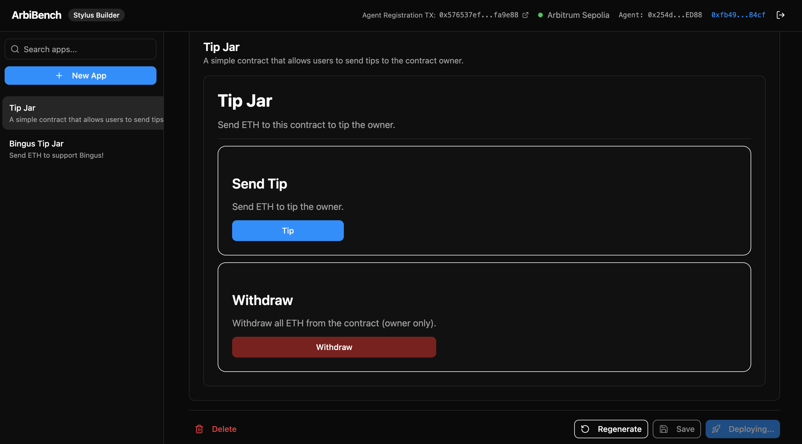

# ArbiBench



A no-code dApp builder for Arbitrum Stylus. Describe your app in plain English and ArbiBench generates a deployable Rust smart contract (compiled to WASM via Stylus) and a dynamic frontend UI — all in one click.

Built for the [ArbiLink Hackathon](https://arbilink.io) — April 2026.

## What It Does

1. **Describe** — Type what you want to build (e.g. "a tip jar where anyone can send ETH and the owner can withdraw")
2. **Generate** — An AI agent (Gemini 2.0 Flash via OpenRouter) writes the Rust/Stylus contract and a JSON UI schema
3. **Review** — Browse the generated contract code and rendered UI preview
4. **Deploy** — One click deploys to Arbitrum Sepolia with automatic build-fix-retry (up to 3 LLM-assisted iterations if compilation fails)

## Features

- AI-generated Arbitrum Stylus contracts (Rust/WASM, SDK 0.10.2)
- Dynamic JSON-to-UI rendering with shadcn/ui components
- Sign In With Ethereum (SIWE) — only the wallet that created an app can edit or deploy it
- App persistence in SQLite (better-sqlite3)
- Sidebar with all your apps, status badges (draft / deploying / deployed)
- Build-fix-retry loop: on compilation failure, errors are fed back to the LLM for up to 3 repair attempts
- Links to Arbitrum Sepolia explorer after deployment

## Agent Registration

The ArbiBench AI agent is registered on the ArbiLink Agent Registry on Arbitrum Sepolia:

**TX:** `0x576537efa3392a680e91d9716286531ebb88baaebc2290dede74a314fdfa9e88`

[View on Arbiscan](https://sepolia.arbiscan.io/tx/0x576537efa3392a680e91d9716286531ebb88baaebc2290dede74a314fdfa9e88)

## Tech Stack

| Layer | Tech |
|---|---|
| Frontend | Vite + React + TypeScript + Tailwind CSS + shadcn/ui |
| Backend | Node.js + Express + TypeScript |
| Database | SQLite via better-sqlite3 |
| AI | OpenRouter API → Google Gemini 2.0 Flash |
| Smart Contracts | Arbitrum Stylus SDK 0.10.2 (Rust/WASM) |
| Deploy Tooling | cargo-stylus 0.10.2, Rust 1.87.0 |
| Auth | Sign In With Ethereum (SIWE) via MetaMask + viem |
| Wallet Interactions | ethers.js (frontend), viem (signature verification) |

## Project Structure

```
arbibench/
├── client/          # Vite + React frontend
├── server/          # Node.js + Express backend
│   ├── src/
│   │   ├── routes/  # apps, deploy, auth
│   │   ├── services/
│   │   │   ├── llm.ts      # OpenRouter/Gemini — generate + fix contracts
│   │   │   ├── deploy.ts   # cargo-stylus build-fix-retry + deploy pipeline
│   │   │   └── storage.ts  # SQLite CRUD
│   │   └── prompts/
│   │       └── system.ts   # Stylus SDK 0.10.2 system prompt
└── shared/          # Shared TypeScript types/schema
```

## Setup

### Prerequisites

- Node.js 20+
- Rust + Cargo (rustup)
- `cargo install cargo-stylus` (requires Rust 1.87.0)

### Environment Variables

Copy `.env.example` to `.env` in the project root:

```env
OPENROUTER_API_KEY=sk-or-v1-...
AGENT_PRIVATE_KEY=0x...          # Private key of the deployer wallet (needs testnet ETH)
ARBITRUM_SEPOLIA_RPC=https://sepolia-rollup.arbitrum.io/rpc
AGENT_REGISTRATION_TX=0x576537efa3392a680e91d9716286531ebb88baaebc2290dede74a314fdfa9e88
```

The deployer wallet needs ~0.005 ETH on Arbitrum Sepolia. Get it from the [Arbitrum Sepolia faucet](https://faucet.arbitrum.io).

### Install & Run

```bash
npm install

# Terminal 1 — backend (port 3001)
npm run dev:server

# Terminal 2 — frontend (port 5173)
npm run dev:client
```

Open [http://localhost:5173](http://localhost:5173), connect MetaMask (Arbitrum Sepolia), and start building.

## How Deployment Works

When you click "Deploy to Arbitrum":

1. The server creates a temporary Rust workspace with a Stylus.toml
2. Runs `cargo generate-lockfile` then `cargo stylus check`
3. If the build fails, compilation errors are sent to the LLM which returns a fixed contract — repeated up to 3 times
4. On success, runs `cargo stylus deploy --no-verify --max-fee-per-gas-gwei 1`
5. The contract address and TX hash are saved to the app record

## License

MIT
